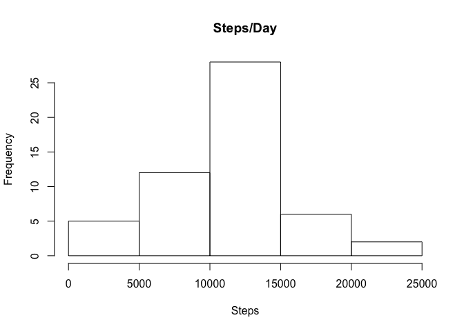
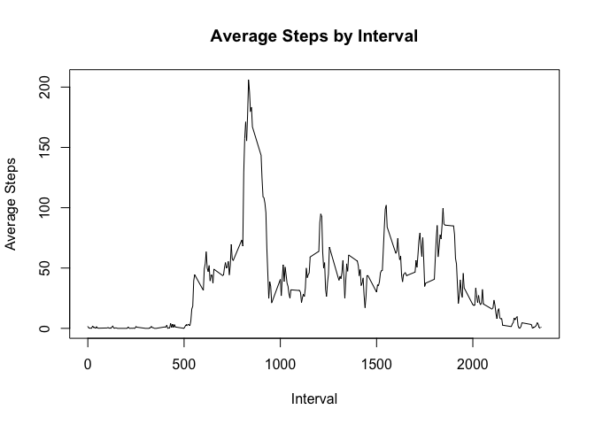
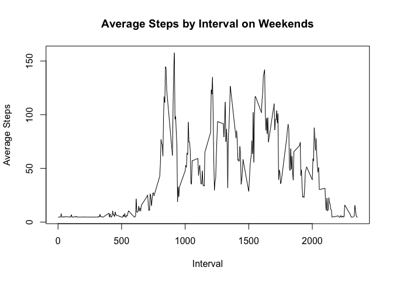
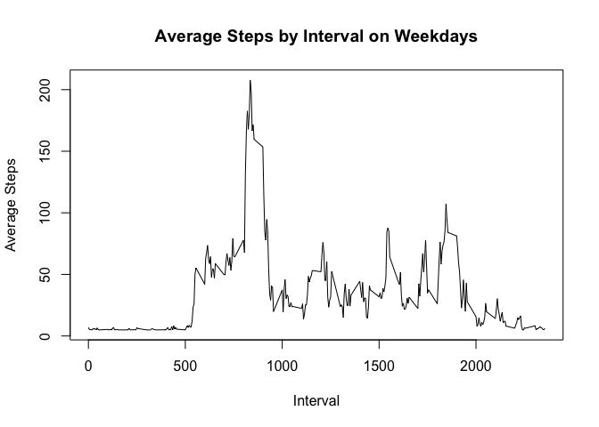

# Reproducible Research: Peer Assessment 1

The [activity.zip][1] archive contains the a csv file with data from a personal activity monitoring device. This device collects data at 5 minute intervals through out the day. The data consists of two months of data from an anonymous individual collected during the months of October and November, 2012 and include the number of steps taken in 5 minute intervals each day.

## Loading and preprocessing the data
The csv file has to be extracted from the archive and then loaded into R for further analysis. There are instances in the data where the number of steps taken in a particular interval are not available, we need to remove the cases where any readings are not available so that we have a clean dataset for later processing


```r
download.file("https://d396qusza40orc.cloudfront.net/repdata%2Fdata%2Factivity.zip", destfile = "activity.zip", method = "curl")
unzip("activity.zip")
data <- read.csv("activity.csv")
clean_data <- data[complete.cases(data),]
```

## What is mean total number of steps taken per day?

```r
steps_per_day <- tapply(data$steps, data$date, sum)
hist(steps_per_day, main = "Steps/Day", xlab = "Steps")
```

 


```r
mean_steps <- as.integer(mean(steps_per_day, na.rm = TRUE))
median_steps <- median(steps_per_day, na.rm = TRUE)
```
The mean of the number of steps taken per day is 10766 and the median is 10765.

## What is the average daily activity pattern?

```r
steps_per_interval <- tapply(data$steps, data$interval, mean, na.rm=TRUE)
plot(unique(data$interval), steps_per_interval, type = "l", xlab = "Interval", ylab = "Average Steps",  main = "Average Steps by Interval")
```

 


Maximum number of steps were taken in the interval 835

## Imputing missing values
While analyzing the dataset we had seen that there are a lot of missing values.

```r
nrow(data) - nrow(clean_data)
```

```
## [1] 2304
```

To imput the data lets use a simple strategy of filling NAs with the mean number of steps for clean data.

```r
clean_mean <- as.integer(mean(clean_data$steps))

for (i in 1:nrow(data)) {
    if (is.na(data[i,]$steps))
        data[i,]$steps <- clean_mean
}

steps_per_day <- tapply(data$steps, data$date, sum)
hist(steps_per_day, main = "Steps/Day", xlab = "Steps")
```

 

```r
mean_steps <- as.integer(mean(steps_per_day, na.rm = TRUE))
median_steps <- median(steps_per_day, na.rm = TRUE)
```
The mean of the number of steps taken per day is 10751 and the median is 10656.
We can see that after imputing the values there is not much difference in new mean and median.


## Are there differences in activity patterns between weekdays and weekends?
Lets add a colum to our dataset indicating if the day is weekday or weekend

```r
day_type <- c()
day <- weekdays(as.Date(data$date))

for (i in 1:nrow(data)) {
    if (day[i] == "Saturday" | day[i] == "Sunday")
        day_type[i] = "Weekend"
    else
        day_type[i] = "Weekday"
}

data$day_type <- day_type
```
Now lets analyze the user behavior on weekdays and weekends:

```r
data_by_day <- split(data, data$day_type)

weekend_data <- tapply(data_by_day[["Weekend"]]$steps, data_by_day[["Weekend"]]$interval, mean)
weekday_data <- tapply(data_by_day[["Weekday"]]$steps, data_by_day[["Weekday"]]$interval, mean)

plot(unique(data$interval), weekend_data, type = "l", xlab = "Interval", ylab = "Average Steps",  main = "Average Steps by Interval on Weekends")
```

 

```r
plot(unique(data$interval), weekday_data, type = "l", xlab = "Interval", ylab = "Average Steps",  main = "Average Steps by Interval on Weekdays")
```

 

[1]: https://d396qusza40orc.cloudfront.net/repdata%2Fdata%2Factivity.zip "activity.zip"
